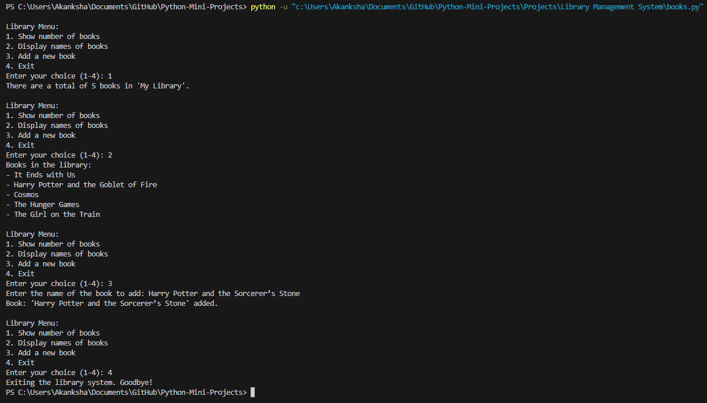

# Library Management System

This guide demonstrates how to implement a simple library management system using Python. The system allows you to display the number of books, view the list of books, and add new books to the library. It features a menu-driven interface for user interaction.

<br>

<p align="center">
    
</p>
<br>

## 🌟 Explanation

- **Library Management**: The script manages a collection of books in a library, allowing various interactions.
- **Menu-Driven Interface**: Provides options to show the number of books, display the names of books, add new books, and exit the system.
- **Book Management**: Uses methods to add new books and display existing ones.

<br>

## ⚙️ Prerequisites

- **Basic Python Knowledge**: Understanding of Python syntax, functions.
- **Familiarity with Lists**: Basic knowledge of lists and loops in Python.

<br>

## 🛠️ How to Run

1. **Ensure the script is saved as** `library_management.py`:
    - Copy the provided script code and save it as `library_management.py`.

2. **Run the script**:
    ```bash
    python library_management.py
    ```

   This will start the menu-driven interface for managing the library.

<br>

## 📺 Output



<br>

## 📜 Conclusion

This script provides a simple interface for managing a library's book collection. It demonstrates basic concepts of user interaction, list management, and method implementation in Python.

<br>

## 👻 Author

[Akanksha Kanade](https://github.com/CandyBeans1609)

